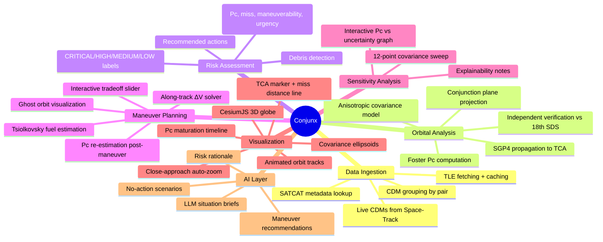
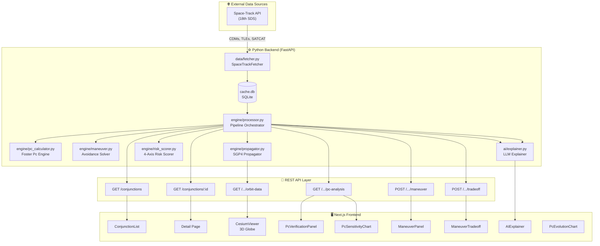
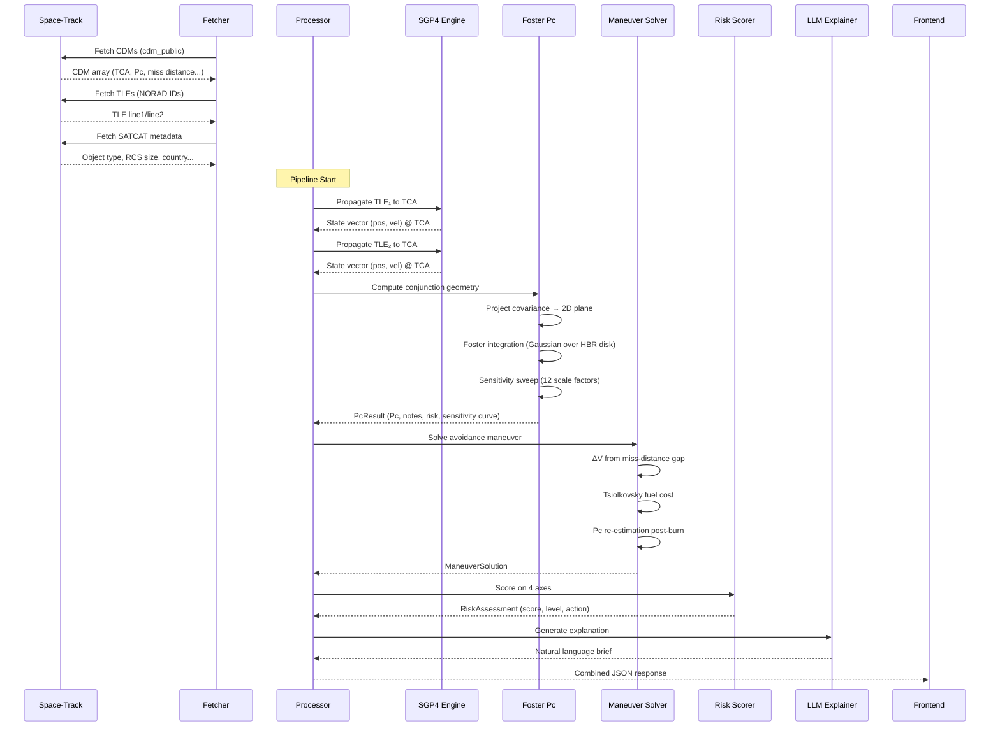

# Conjunx — Conjunction Analysis Engine

Conjunx is a **satellite conjunction analysis and collision avoidance decision engine** that ingests live Conjunction Data Messages (CDMs) from the US Space Force's 18th Space Defense Squadron via Space-Track, independently verifies collision probability using orbital mechanics, and provides actionable maneuver recommendations — all through a mission-control-grade web interface with 3D orbital visualization.

## 🚀 Features

- **Live Data Ingestion**: Live CDMs from Space-Track, TLE fetching + caching, and SATCAT metadata lookup.
- **Orbital Analysis**: SGP4 propagation to TCA, conjunction plane projection, Foster Pc computation, anisotropic covariance modeling, and independent verification vs 18th SDS.
- **Risk Assessment**: 4-axis scoring (Pc, miss, maneuverability, urgency) with CRITICAL/HIGH/MEDIUM/LOW labels and debris detection.
- **Maneuver Planning**: Along-track ΔV solver, Tsiolkovsky fuel estimation, Pc re-estimation post-maneuver, and an interactive tradeoff slider.
- **Sensitivity Analysis**: 12-point covariance sweep and interactive Pc vs uncertainty graph.
- **3D Visualization**: CesiumJS 3D globe with animated orbit tracks, TCA marker, miss-distance line, covariance ellipsoids, and close-approach auto-zoom.
- **AI Explainability**: LLM-generated situation briefs, risk rationale, and maneuver recommendations.

### What Conjunx Covers Today



## ⚙️ System Architecture



### Python Backend (FastAPI)
The backend acts as an independent verification engine:
- `data/fetcher.py`: Space-Track API client with SQLite caching.
- `engine/processor.py`: Pipeline orchestrator.
- `engine/pc_calculator.py`: Foster & Estes (1992) Pc engine.
- `engine/maneuver.py`: Avoidance maneuver solver.
- `engine/propagator.py`: SGP4 orbit propagation.
- `engine/risk_scorer.py`: 4-axis risk scoring.
- `ai/explainer.py`: LLM-powered context and recommendations.

### Next.js Frontend
Mission-control UI built with React, CesiumJS, and Tailwind CSS.
Provides a 60/40 split layout mapping a 3D globe to analysis panels including an interactive Maneuver Tradeoff slider, Pc Sensitivity charts, and historical Pc Maturation tracking.

## 🛠️ Technology Stack

| Layer | Technology |
|---|---|
| Backend | Python 3.12, FastAPI, Uvicorn |
| Orbit Mechanics | SGP4 (`sgp4`), SciPy (numerical integration) |
| Data Source | Space-Track REST API (18th SDS) |
| Caching | SQLite |
| Frontend | Next.js 16, React 19, TypeScript |
| 3D Visualization | CesiumJS (WebGL globe) |
| Charts | Raw HTML5 Canvas |
| Styling | Tailwind CSS (dark mission-control theme) |

## 📦 File Structure

```
Conjunx/
├── api/             # FastAPI routes
├── ai/              # LLM situation briefs
├── data/            # Space-Track client + SQLite cache
├── engine/          # Math: Pc solver, propagator, maneuver solver
├── frontend/        # Next.js web application
│   ├── src/app/
│   ├── src/components/
│   └── src/lib/
├── run.py           # Backend server entry point
└── requirements.txt # Python dependencies
```

## 🧠 Data Pipeline



1. **Fetch**: Ingests CDMs, TLEs, and SATCAT from Space-Track.
2. **Propagate**: Uses SGP4 to propagate both satellites' TLEs to Time of Closest Approach (TCA).
3. **Analyze geometry**: Computes the miss vector and projects it onto the 2D conjunction plane.
4. **Compute Pc**: Integrates a 2D Gaussian over the hard-body collision cross-section (Foster's method).
5. **Solve maneuver**: Calculates the required ΔV to double the miss distance (min 1 km) using an along-track burn.
6. **Score & Explain**: Scores the risk on 4 axes and asks an LLM to generate an operator brief.
7. **Visualize**: Pre-computes 95-minute ECEF orbit tracks for CesiumJS rendering.
