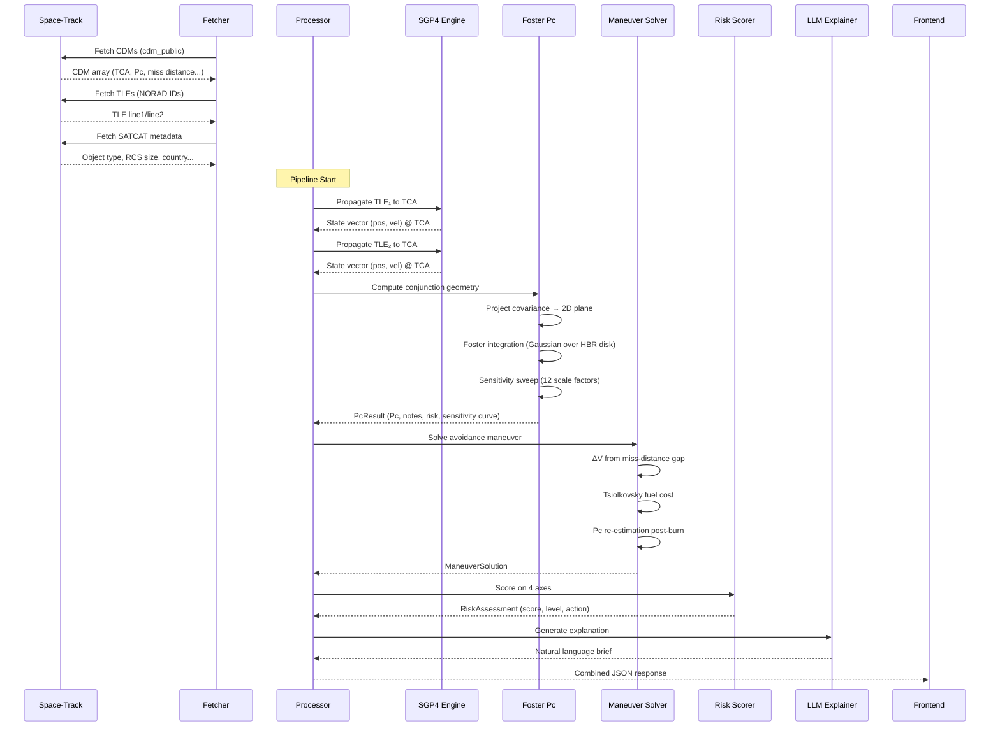

# Conjunx

**Satellite conjunction analysis and collision avoidance decision engine.**

Pulls live Conjunction Data Messages (CDMs) from the 18th Space Defense Squadron via Space-Track, recomputes collision probability independently using Foster's method, figures out what avoidance burn to execute and what it'll cost in fuel, and puts it all on a 3D globe.

### **[Live Demo →](https://conjunx.vercel.app/)**

---

## Background

This didn't start as a tool. I was trying to understand how collision probability actually works — not the high-level concept, the actual math.

That turned into three separate research projects:

- **[CDM Pc Maturation](https://github.com/yoohooshantanu/cdm-pc-maturation)** — how Pc changes across CDM updates as TCA gets closer, and why the early numbers are often junk
- **[FY-1C Conjunction Analysis](https://github.com/yoohooshantanu/fy1c-conjunction-analysis)** — conjunction events involving Fengyun-1C debris (the 2007 ASAT test, 3,000+ tracked fragments still causing problems in LEO)
- **[CDM Covariance Assessment](https://github.com/yoohooshantanu/cdm-covariance-assessment)** — the gap between what CDMs publish and actual covariance quality, and how much that gap messes up Pc

Each one taught me something about why conjunction assessment is harder than it looks. Conjunx is the tool I wanted while doing that work — data pipeline, orbital mechanics, risk math, and visualization in one place instead of five.

---

## Why This Exists

The 18th SDS publishes CDMs when two cataloged objects are predicted to pass close. The CDM tells you *what* the risk is. It doesn't tell you *what to do about it*.

Operators spend hours pulling data from separate tools, running their own propagations, questioning covariance assumptions, and making go/no-go calls under time pressure. Conjunx puts all of that in one pipeline: ingest → verify → plan → visualize → decide.

---

## What It Actually Does

### Data Ingestion

The backend authenticates with Space-Track and fetches three data types:

- **CDMs** (`cdm_public`) — emergency-reportable conjunction warnings with published Pc, miss distance, and TCA
- **TLEs** (General Perturbations) — two-line element sets for orbit propagation
- **SATCAT** — satellite catalog metadata: object type, RCS size, country of origin

All of it is cached in SQLite with TTLs (8h for CDMs, 1h for TLEs, 24h for SATCAT). No network request if the cache is fresh. Falls back to stale cache when Space-Track is down. A fetch log tracks hit rates.

### Independent Collision Probability Verification

Public CDMs give you a Pc value but no covariance matrices — those aren't public. So Conjunx estimates them and runs the math independently:

1. **Propagate both TLEs to TCA** using SGP4 (via the `sgp4` library) to get ECI state vectors
2. **Compute conjunction geometry** — the miss vector, relative velocity, and the 2D conjunction plane perpendicular to the relative velocity vector
3. **Assign covariance from RCS size** — a lookup table maps object type and radar cross-section category to anisotropic RSW-axis position uncertainties (radial, along-track, cross-track). These are based on Space Surveillance Network screening-quality precision, roughly 5× tighter than the TLE-level values in Hejduk & Snow (2018)
4. **Project combined covariance onto the conjunction plane** — `C_2d = T · C_3d · T^T` where T is the 2×3 projection matrix built from the plane's basis vectors
5. **Integrate using Foster & Estes (1992)** — a 2D Gaussian centered at the miss-distance offset, integrated over the circular hard-body cross-section using `scipy.integrate.dblquad` in polar coordinates

You get an independent Pc to compare against Space-Track's number. For well-tracked objects with fresh TLEs, agreement is usually within 20%. When it diverges, the reason is usually stale elements, maneuver history, or very different covariance assumptions — and the engine flags which one.

**Sensitivity analysis** sweeps the covariance across 12 scale factors (0.1× to 8×) and returns the full Pc-vs-uncertainty curve, so you can see how sensitive the result is to what you don't know about the covariance.

### Risk Scoring

Each conjunction is scored on four axes (100 points total):

| Axis | Max Points | Thresholds |
|---|---|---|
| Collision probability | 40 | ≥1e-3 → 40, ≥1e-4 → 30, ≥1e-5 → 20 |
| Miss distance | 20 | <100m → 20, <500m → 15, <1km → 10 |
| Maneuverability | 20 | Both debris → 20, one debris → 15, both payloads → 5 |
| Time urgency | 20 | <24h → 20, <48h → 15, <72h → 10 |

Total score maps to a level: **CRITICAL** (≥70), **HIGH** (≥50), **MEDIUM** (≥30), **LOW** (<30). Each level has a recommended action that checks whether either object can actually maneuver.

### Maneuver Planning

The solver computes an along-track avoidance burn:

- **Target**: double the current miss distance, or reach 1 km minimum — whichever is larger
- **ΔV estimation**: linear miss-distance mapping for small burns applied well before TCA
- **Fuel cost**: Tsiolkovsky rocket equation with configurable spacecraft mass and Isp
- **Pc re-estimation**: scales the original Pc using the Alfano/Foster short-encounter model (`Pc ∝ exp(-d²/2σ²)`)
- **Feasibility gate**: anything over 10 m/s is flagged as impractical

The **tradeoff slider** lets you pick any ΔV and see the resulting miss distance, new Pc, and fuel cost update live. For past-TCA events it switches to hypothetical mode (assumes 6-hour lead) so the slider still works for what-if analysis.

### AI Situation Briefs

Optional LLM layer (Azure OpenAI GPT-4o) writes situation summaries, risk rationale, maneuver recommendations, and a "what happens if you ignore this" scenario. When the API isn't configured, a template engine fills the same fields with deterministic text. Frontend doesn't care which one answered.

### 3D Visualization

The frontend renders a CesiumJS globe with:

- Animated orbit tracks for both objects (95 minutes of ECEF positions at 30-second intervals)
- TCA marker at the point of closest approach
- Miss-distance line connecting both objects at TCA
- Covariance ellipsoids representing position uncertainty
- Auto-zoom to the close-approach region
- Ghost orbit overlay showing the post-maneuver trajectory when using the tradeoff slider

Positions are propagated in TEME on the backend and rotated to ECEF via IAU 1982 GMST, so the tracks are frame-correct on the globe.

---

## Design Decisions

**Why verify Pc independently instead of just showing Space-Track's number?**
If your computation agrees with Space-Track, good — that's confidence. If it doesn't, the *reason* it doesn't (stale TLEs, covariance mismatch, maneuver history) is useful information. You don't get that by just displaying someone else's Pc.

**Why estimate covariance from RCS size instead of using a fixed value?**
A 10-meter payload and a 1-cm debris fragment have wildly different position uncertainty. One covariance for everything hides real risk differences. The lookup table isn't perfect, but it gives anisotropic uncertainties that behave right under conjunction-plane projection.

**Why only along-track burns?**
It's the most fuel-efficient direction for miss-distance changes in LEO and what most operators would actually do. Adding radial and cross-track burns adds complexity and doesn't change the decision most of the time.

**Why Canvas charts instead of D3 or Chart.js?**
The sensitivity curve has log-scale Pc and categorical covariance factors — unusual axes that fight most charting libraries. Also, no extra dependency to manage. The whole frontend is React + CesiumJS + Tailwind.

**Why SQLite instead of Redis or Postgres?**
Single-user tool, not a multi-tenant service. SQLite gives me schema and indexing with zero infrastructure. The cache file is portable and can be deleted to force a refresh.

**Why template fallback for AI briefs?**
If someone's looking at a conjunction at 3 AM and the Azure endpoint is down, they still need the situation brief. Template engine produces the same JSON structure, same fields. Frontend doesn't know the difference.

---

## Architecture

```
┌──────────────────────────────────────────────────────────┐
│                    Space-Track API                       │
│              (18th Space Defense Squadron)                │
└────────────────────────┬─────────────────────────────────┘
                         │ CDMs, TLEs, SATCAT
                         ▼
┌──────────────────────────────────────────────────────────┐
│  Python Backend (FastAPI)                                │
│                                                          │
│  data/fetcher.py ─── Authenticated client + SQLite cache │
│       │                                                  │
│       ▼                                                  │
│  engine/processor.py ─── Pipeline orchestrator           │
│       │                                                  │
│       ├── engine/propagator.py ─── SGP4 propagation      │
│       ├── engine/pc_calculator.py ── Foster Pc engine    │
│       ├── engine/maneuver.py ──── Avoidance solver       │
│       ├── engine/risk_scorer.py ── 4-axis risk scoring   │
│       └── ai/explainer.py ─────── LLM / template briefs │
│                                                          │
│  api/main.py ─── REST endpoints                          │
│    GET  /conjunctions                                    │
│    GET  /conjunctions/:id                                │
│    GET  /conjunctions/:id/pc-analysis                    │
│    GET  /conjunctions/:id/pc-history                     │
│    GET  /conjunctions/:id/orbit-data                     │
│    GET  /conjunctions/:id/explanation                    │
│    POST /conjunctions/:id/maneuver                       │
│    POST /conjunctions/:id/tradeoff                       │
└────────────────────────┬─────────────────────────────────┘
                         │ JSON
                         ▼
┌──────────────────────────────────────────────────────────┐
│  Next.js Frontend (React 19 + TypeScript)                │
│                                                          │
│  ConjunctionList ──── Risk-sorted event dashboard        │
│  Detail Page ──────── Full analysis for one conjunction  │
│    ├── CesiumViewer ─── 3D globe with orbit tracks       │
│    ├── PcVerificationPanel ── Foster vs Space-Track      │
│    ├── PcSensitivityChart ─── Pc vs covariance scaling   │
│    ├── PcEvolutionChart ───── Pc maturation over time    │
│    ├── ManeuverPanel ──────── ΔV, fuel, timing           │
│    ├── ManeuverTradeoff ───── Interactive ΔV slider      │
│    └── AIExplainer ────────── Situation brief             │
└──────────────────────────────────────────────────────────┘
```

---

## Tech Stack

| Layer | What | Why |
|---|---|---|
| Backend | Python 3.12, FastAPI, Uvicorn | Async-first, clean API layer |
| Orbit mechanics | `sgp4` (C-extension), NumPy, SciPy | SGP4 propagation, numerical integration for Pc |
| Data source | Space-Track REST API | Only public source for CDMs and catalog data |
| Cache | SQLite | Zero-config, file-based, works everywhere |
| Frontend | Next.js 16, React 19, TypeScript | Server components, fast dev iteration |
| 3D rendering | CesiumJS 1.134 | WebGL globe with time-dynamic entities |
| Charts | HTML5 Canvas (hand-rolled) | No chart library dependency, full control |
| Styling | Tailwind CSS 4 | Dark mission-control aesthetic |
| AI (optional) | Azure OpenAI GPT-4o | Structured operator briefs |

---

## Project Structure

```
Conjunx/
├── api/
│   └── main.py              # FastAPI app, all REST endpoints, request caching
├── ai/
│   └── explainer.py          # LLM prompt engineering + template fallback
├── data/
│   ├── fetcher.py            # Space-Track auth, CDM/TLE/SATCAT fetch, SQLite cache
│   └── demo.py               # Sample conjunction for when Space-Track is unavailable
├── engine/
│   ├── processor.py          # Pipeline orchestrator — ties everything together
│   ├── pc_calculator.py      # Foster Pc: propagation, geometry, covariance, integration
│   ├── propagator.py         # SGP4 wrapper, orbit track generation for Cesium
│   ├── maneuver.py           # ΔV solver, Tsiolkovsky fuel, Pc re-estimation
│   └── risk_scorer.py        # 4-axis scoring with level assignment
├── frontend/
│   ├── src/
│   │   ├── app/              # Next.js pages and layouts
│   │   ├── components/       # 9 React components (Cesium, charts, panels)
│   │   └── lib/              # API client utilities
│   ├── public/               # Static assets, Cesium workers
│   └── package.json
├── run.py                    # python run.py → starts backend on :8000
├── requirements.txt
└── .env.example              # Space-Track, Azure OpenAI, Cesium Ion tokens
```

---

## Getting Started

### Prerequisites

- Python 3.11+
- Node.js 18+
- A [Space-Track](https://www.space-track.org) account (free, requires approval)
- A [Cesium Ion](https://ion.cesium.com) token (free tier works)
- Azure OpenAI credentials (optional — the AI explainer falls back to templates)

### Setup

```bash
# Clone
git clone https://github.com/yoohooshantanu/Conjunx.git
cd Conjunx

# Backend
cp .env.example .env
# Fill in SPACETRACK_EMAIL, SPACETRACK_PASSWORD, NEXT_PUBLIC_CESIUM_TOKEN

pip install -r requirements.txt
python run.py
# Backend runs on http://localhost:8000

# Frontend (separate terminal)
cd frontend
npm install
npm run dev
# Frontend runs on http://localhost:3000
```

First load fetches CDMs from Space-Track and fills the SQLite cache. After that it uses the cache until TTLs expire. Without Space-Track credentials, the app shows a demo conjunction so the UI still works.

---

## Data Pipeline



1. **Fetch** — CDMs, TLEs, and SATCAT from Space-Track. Cached per-object with per-type TTLs.
2. **Propagate** — SGP4 takes both TLEs forward (or backward) to the Time of Closest Approach.
3. **Geometry** — Miss vector projected onto the 2D conjunction plane (perpendicular to relative velocity).
4. **Pc** — 2D Gaussian integrated over the hard-body disk. Foster & Estes (1992), implemented with `dblquad`.
5. **Maneuver** — Along-track ΔV to double miss distance (min 1 km). Tsiolkovsky for fuel. Alfano scaling for post-burn Pc.
6. **Score** — Four axes, composite score, level label, recommended action.
7. **Explain** — LLM or template-based brief with urgency classification.
8. **Visualize** — 95-minute ECEF orbit tracks for CesiumJS, TEME→ECEF via GMST rotation.

---

## API Reference

| Method | Endpoint | Description |
|---|---|---|
| `GET` | `/health` | Status, cache stats, sample conjunction |
| `GET` | `/conjunctions` | All CDMs grouped by pair, risk-scored, sorted by severity |
| `GET` | `/conjunctions/:id` | Full detail: CDM fields, maneuver, risk, state vectors, orbit tracks |
| `GET` | `/conjunctions/:id/pc-analysis` | Independent Foster Pc vs Space-Track, with sensitivity curve |
| `GET` | `/conjunctions/:id/pc-history` | Pc evolution across all CDM updates for a conjunction pair |
| `GET` | `/conjunctions/:id/orbit-data` | Pre-computed ECEF orbit points for Cesium rendering |
| `GET` | `/conjunctions/:id/explanation` | AI-generated situation brief (loaded separately to avoid blocking) |
| `POST` | `/conjunctions/:id/maneuver` | Recompute maneuver with custom mass (kg) and Isp (s) |
| `POST` | `/conjunctions/:id/tradeoff` | Evaluate a specific ΔV: resulting miss distance, Pc, fuel cost |

---

## Limitations

Not a flight-certified system. Worth knowing:

- **Covariance is estimated, not measured.** Public CDMs don't include covariance. The RCS-based lookup table is a proxy, not a substitute for actual tracking data. That's what the sensitivity analysis is for — see how much the answer changes when the covariance is wrong.
- **TLE propagation degrades with age.** Conjunx logs TLE age and flags anything over 24 hours. Objects with recent maneuvers can be way off.
- **Along-track burns only.** Most fuel-efficient direction, but not always optimal. Radial and cross-track burns aren't modeled.
- **No conjunction screening.** Doesn't discover conjunctions — only analyzes CDMs the 18th SDS already published.
- **Demo mode.** Without Space-Track creds, you get one hard-coded conjunction. Math and viz still work, data isn't live.

---

## What's Next

If I keep working on this:

- **Real covariance** — use actual OD covariance instead of the RCS lookup when it's available
- **Multi-axis maneuver solver** — radial and cross-track burns, combined ΔV optimization
- **Monte Carlo Pc** — 10k samples from the covariance distribution instead of one Foster integral, catches non-Gaussian tails
- **Conjunction screening** — propagate a full catalog and find close approaches independently, don't depend on 18th SDS
- **Alerts** — webhook/email when a CDM crosses a risk threshold
- **Multi-user** — per-operator satellite watchlists with custom mass, Isp, and maneuver constraints

---

## References

- Foster, J. L. & Estes, H. S. (1992). *A Parametric Analysis of Orbital Debris Collision Probability and Maneuver Rate for Space Vehicles.* NASA JSC-25898.
- Hejduk, M. D. & Snow, D. E. (2018). *Satellite Conjunction Assessment Risk Analysis.*
- Alfano, S. (2005). *A Numerical Implementation of Spherical Object Collision Probability.* Journal of the Astronautical Sciences.
- Vallado, D. A. (2013). *Fundamentals of Astrodynamics and Applications.* 4th ed. — SGP4 implementation reference.
